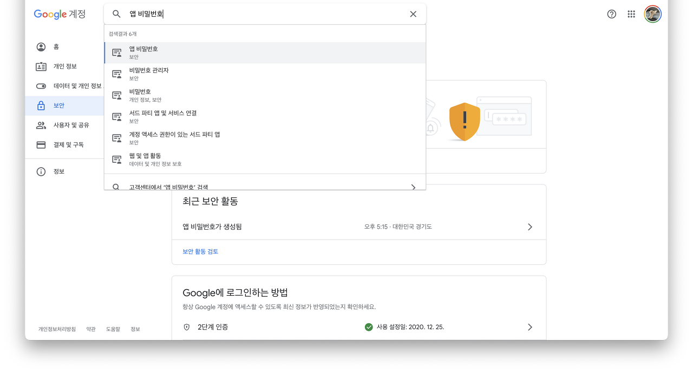
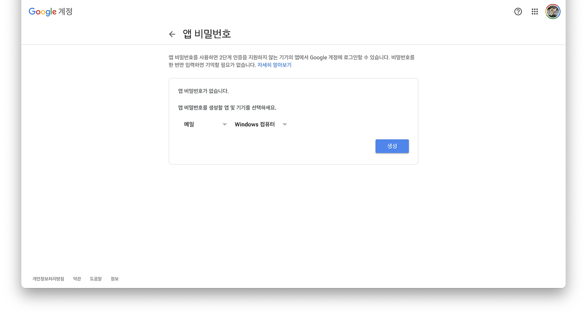
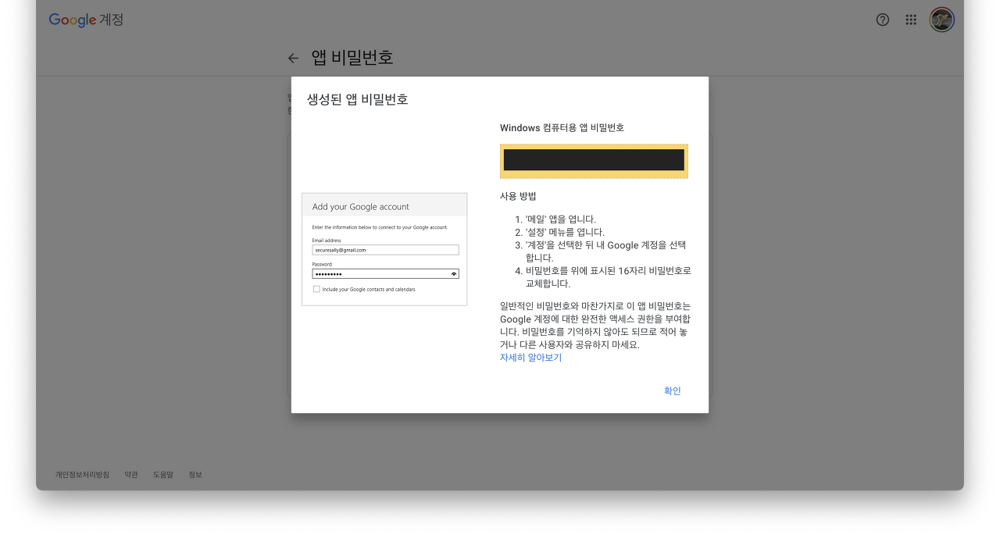
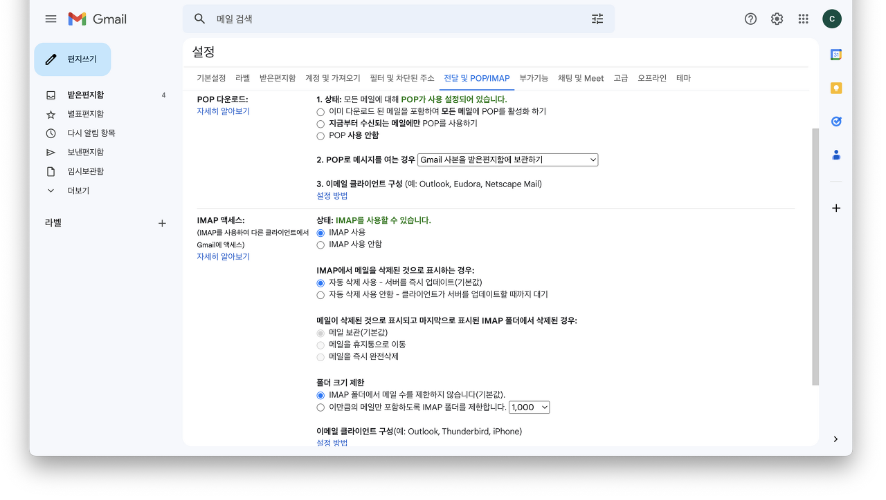

# 포팅 메뉴얼

# 목차

1. 개발환경
2. Infra 설정(Ubuntu Server)
    1. 도커 설치
    2. SSL
    3. NGINX
    4. MySQL
    5. Elastic Search
    6. Redis
3. Backend 설정
    1. smtp 설정
    2. application.yml
    3. dockerfile
4. Frontend 설정
    1. node.js 설치
    2. 설정파일 추가
5. Python AI 서버 설정
    1. environment.yml 
    2. dockerfile
    

# 1. 개발환경

1. Infra 
    1. Amazon EC2 (Ubuntu 20.04.6 LTS)
    2. Docker 24.0.5
    3. NGNIX 1.18.0
    4. Amazon S3
2. Backend
    1. IntelliJ IDEA 2023.3.6
    2. Java 17
    3. Spring 3.2.3
    4. MySQL 8.0.36
    5. Elastic Search 8.13.2
    6. 설치된 패키지는 build.grade 참고
3. Frontend
    1. node.js 20.11.1
    2. next.js 14.2.2
    3. 설치된 패키지는 package.json 참고
4. Python AI 서버
    1. Ubuntu 20.04.6 LTS
    2. Nvidia Graphic Driver 515.65.01
    3. CUDA 12.1
    4. cuDNN 8.9.5
    5. Python 3.9.18
    6. Pytorch 1.13.1
    7. anaconda 4.10.3
    8. 설치된 패키지는 enivornment.yml 참고

# 2. Infra 설정(Ubuntu Server)

1. 초기 세팅
    1. docker 설치
        1. 충돌 패키지 삭제
            
            `for pkg in docker.io docker-doc docker-compose docker-compose-v2 podman-docker containerd runc; do sudo apt-get remove $pkg; don`
            
        2. 도커 apt 레포지토리 설정
            
            ```
            # Add Docker's official GPG key:
            sudo apt-get update
            sudo apt-get install ca-certificates curl
            sudo install -m 0755 -d /etc/apt/keyrings
            sudo curl -fsSL https://download.docker.com/linux/ubuntu/gpg -o /etc/apt/keyrings/docker.asc
            sudo chmod a+r /etc/apt/keyrings/docker.asc
            
            # Add the repository to Apt sources:
            echo \
              "deb [arch=$(dpkg --print-architecture) signed-by=/etc/apt/keyrings/docker.asc] https://download.docker.com/linux/ubuntu \
              $(. /etc/os-release && echo "$VERSION_CODENAME") stable" | \
              sudo tee /etc/apt/sources.list.d/docker.list > /dev/null
            sudo apt-get update
            ```
            
        3. 도커 설치
            
            `sudo apt-get install docker-ce docker-ce-cli containerd.io docker-buildx-plugin docker-compose-plugin`
            
        4. sudo 명령어 없이 docker 명령어 사용
            
            `sudo usermod -aG docker ubuntu`
            
2. SSL 인증서 적용
    1. certbot 설치
        
        `sudo apt-get install python-certbot-nginx`
        
    2. nginx가 이미 설치되어 있으면 중지
        
        `sudo systemctl stop nginx`
        
    3. port 80과 port 443을 사용하는 프로세스가 없는지 확인(사용하는 프로세스가 있으면 kill)
        
        `sudo lsof -i tcp:443`
        
        `sudo lsof -i tcp:80`
        
    4. SSL 인증서를 도메인에 적용
        
        `sudo certbot —nginx -d <domain-name>`
        
3. NGINX 설정
    1. nginx 설치
        
        `sudo apt update`
        
        `sudo apt install nginx`
        
    2. SSL 적용때문에 nginx가 죽어있다면 다시 시작
        
        `sudo systemctl start nginx`
        
    3. port 80, port 443 방화벽 설정
        
        `sudo ufw allow 80`
        
        `sudo ufw allow 443`
        
    4. nginx.conf 파일 설정
        - /etc/nginx/conf.d 폴더에 다음 파일 추가
            
            ```
            # HTTP 서버를 HTTPS로 리디렉트
            server {
                listen 80;
                server_name <domain-name>;
                return 301 https://$server_name$request_uri;
            }
            
            # HTTPS 서버 설정
            server {
                listen 443 ssl;
                server_name <domain-name>;
            
                ssl_certificate /etc/letsencrypt/live/<domain-name>/fullchain.pem; # SSL 인증서
                ssl_certificate_key /etc/letsencrypt/live/<domain-name>/privkey.pem; # SSL 개인 키
            
                location / {
                    proxy_pass http://localhost:3000; # Next 앱으로의 요청 처리
                    proxy_http_version 1.1;
                    proxy_set_header Upgrade $http_upgrade;
                    proxy_set_header Connection 'upgrade';
                    proxy_set_header Host $host;
                    proxy_cache_bypass $http_upgrade;
                }
            
                location /api/ {
                    proxy_pass http://localhost:8080; # 스프링 부트 앱으로의 API 요청 처리
            
                    proxy_http_version 1.1;
                    proxy_set_header Upgrade $http_upgrade;
                    proxy_set_header Connection 'upgrade';
                    proxy_set_header Host $host;
                    proxy_cache_bypass $http_upgrade;
                }
            
                location /api/notifications/subscribe {
                    proxy_pass http://localhost:8080;
                    proxy_set_header Connection '';
                    proxy_set_header Cache-Control 'no-cache';
                    proxy_set_header X-Accel-Buffering 'no';
                    proxy_set_header Content_Type 'text/event-stream';
                    proxy_buffering off;
                    proxy_http_version 1.1;
                    chunked_transfer_encoding on;
                    proxy_read_timeout 86400s;
                }
            }
            
            ```
            
    5. MySQL 설치(docker)
        
        ```
        docker run --name mysql-container -it
        -v ${PWD}/mysql:/var/lib/mysql
        -v ${PWD}/image:/home/ubuntu/image
        -e MYSQL_ROOT_PASSWORD=<PASSWORD> -d -p 3306:3306 mysql:latest
        ```
        
    6. Elastic Search 설치 
        1. docker-elk 레포지토리([https://github.com/deviantony/docker-elk](https://github.com/deviantony/docker-elk)) 클론
        2. docker-elk/.env 파일 수정
            
            ```yaml
            ELASTIC_VERSION=8.13.2
            
            ## Passwords for stack users
            #
            
            # User 'elastic' (built-in)
            #
            # Superuser role, full access to cluster management and data indices.
            # https://www.elastic.co/guide/en/elasticsearch/reference/current/built-in-users.html
            ELASTIC_PASSWORD=<password>
            
            # User 'logstash_internal' (custom)
            #
            # The user Logstash uses to connect and send data to Elasticsearch.
            # https://www.elastic.co/guide/en/logstash/current/ls-security.html
            LOGSTASH_INTERNAL_PASSWORD=<password>
            
            # User 'kibana_system' (built-in)
            #
            # The user Kibana uses to connect and communicate with Elasticsearch.
            # https://www.elastic.co/guide/en/elasticsearch/reference/current/built-in-users.html
            KIBANA_SYSTEM_PASSWORD=<password>
            
            # Users 'metricbeat_internal', 'filebeat_internal' and 'heartbeat_internal' (custom)
            #
            # The users Beats use to connect and send data to Elasticsearch.
            # https://www.elastic.co/guide/en/beats/metricbeat/current/feature-roles.html
            METRICBEAT_INTERNAL_PASSWORD=''
            FILEBEAT_INTERNAL_PASSWORD=''
            HEARTBEAT_INTERNAL_PASSWORD=''
            
            # User 'monitoring_internal' (custom)
            #
            # The user Metricbeat uses to collect monitoring data from stack components.
            # https://www.elastic.co/guide/en/elasticsearch/reference/current/how-monitoring-works.html
            MONITORING_INTERNAL_PASSWORD=''
            
            # User 'beats_system' (built-in)
            #
            # The user the Beats use when storing monitoring information in Elasticsearch.
            # https://www.elastic.co/guide/en/elasticsearch/reference/current/built-in-users.html
            BEATS_SYSTEM_PASSWORD=''
            
            ```
            
        3. elasticsearch, kibana, logstash 설치
            
            ```
            docker-compose up setup
            docker-compose up
            ```
            
    7. Redis 설치
        
        ```jsx
        docker run --name redis-container -v ${PWD}/redis:/data -p 6379:6379 -d redis redis-server --requirepass b203203!
        ```
        
    

# 3. backend 설정

1. smtp 설정
    1. 구글 로그인 → 구글 계정 관리 → 검색창에 “앱 비밀번호” 검색
        
        
        
    2. 앱 : 메일 / 기기 : Winows 컴퓨터로 생성된 앱 비밀번호 따로 저장
        
        
        
        
        
    3. 구글 Gmail → 설정 → 전달 및 POP/IMAP → 아래 이미지처럼 설정 → 변경사항 저장 클릭
        
        
        
2. src/main/resources에 다음 파일 추가
    - application.yml
        
        ```yaml
        server:
          servlet:
            encoding:
              force: true
              charset: UTF-8
            context-path: /api
          port: 8080
        
        spring:
          servlet:
            multipart:
              max-file-size: 10MB
              max-request-size: 10MB
          mail:
            host: smtp.gmail.com
            port: 587
            username: <user@gmail.com>
            password: <password>
            properties:
              mail:
                smtp:
                  auth: true
                  starttls:
                    enable: true
                    required: true
                  connectiontimeout: 5000
                  timeout: 3000
                  writetimeout: 5000
          data:
            redis:
              host: <host>
              port: 6379
              password: <password>
          elasticsearch:
            uris:
        			<host>:<port>
            username: elastic
            password: <password>
        																																																																																																																																																																																																																																																																																																																																																																																																																																																																																																																																																																																																																																																																																																																																																																																																																																																																																																																																																																																																																																																																																																																																																																																																																																																																																																																																																																																																																																																																																																																																																																																																																																																																																																																																																																																																																																																																																																																																																																																																																																																																																																																																																																																																																																																																																																																																																																																																																																																																																																																																																																																																																																																																																																																																																																																																																																																																																																																																																																																																																																																																																														    password: <password>
          datasource:
            driver-class-name: com.mysql.cj.jdbc.Driver
            url: jdbc:mysql://<host>:3306/algonote?useSSL=false&useUnicode=true&allowPublicKeyRetrieval=true
            username: <username>
            password: <password>
          jpa:
            defer-datasource-initialization: true
            hibernate:
              ddl-auto: update
              format_sql: true
              use_sql_comments: true
              highlight_sql: true
            database: mysql
          mvc:
            pathmatch:
              matching-strategy: ant_path_matcher
          kafka:
            consumer:
              properties:
                spring.json.trusted.packages: "*"
                spring.deserializer.key.delegate.class: org.apache.kafka.common.serialization.StringDeserializer
                spring.deserializer.value.delegate.class: org.springframework.kafka.support.serializer.JsonDeserializer
                spring.json.value.default.type: com.ssafy.algonote.problem.dto.ConsumerProblemResDto
                spring.deserializer.value.use.type.headers: false
              bootstrap-servers: <host>:<port>
              group-id: boj
              auto-offset-reset: earliest
              key-deserializer: org.springframework.kafka.support.serializer.ErrorHandlingDeserializer
              value-deserializer: org.springframework.kafka.support.serializer.ErrorHandlingDeserializer
            listener:
              ack-mode: MANUAL
            topic:
              problem: <topic>
        
        logging:
          level:
            org:
              hibernate:
                SQL: OFF
                type:
                  descriptor:
                    sql: trace
        
        jwt:
          expiration_time: 86400000
          secret: <secret>
        
        cloud:
          aws:
            s3:
              bucket: algonote
              prefix: https://<bucketname>.s3.ap-northeast-2.amazonaws.com
            region.static: ap-northeast-2
            credentials:
              access-key: <access-key>
              secret-key: <secret-key>
        
        gpt:
          model: gpt-4o
          api-key: <api-key>
        
        analyze:
          server:
            url: http://<host>/execute
        
        fastapi.url: http://<ip>:8000
        ```
        
3. 빌드하기
    
    ```
    chmod +x gradlew
    ./gradlew clean build
    
    ```
    
4. docker build & run
    
    ```
    FROM openjdk:17-ea
    
    # 타임존 설정
    ENV TZ=Asia/Seoul
    RUN ln -snf /usr/share/zoneinfo/$TZ /etc/localtime && echo $TZ > /etc/timezone
    
    ARG JAR_FILE=./build/libs/algonote-0.0.1-SNAPSHOT.jar
    COPY ${JAR_FILE} app.jar
    
    ENTRYPOINT [ "java", "-jar" ,"./app.jar" ]
    ```
    

# 4. frontend 설정

1. node.js 설치
    
    ```yaml
    # installs nvm (Node Version Manager)
    curl -o- https://raw.githubusercontent.com/nvm-sh/nvm/v0.39.7/install.sh | bash
    
    # download and install Node.js
    nvm install 20
    
    # verifies the right Node.js version is in the environment
    node -v  
    
    # verifies the right NPM version is in the environment
    npm -v 
    ```
    
2. frontend/algonote 폴더 안에서 npm install
3. 설정 파일(.env)
    
    ```yaml
    NEXT_PUBLIC_BASE_URL=<domain-name>
    NEXT_PUBLIC_OPENAI_API_KEY=<NEXT_PUBLIC_OPENAI_API_KEY>
    
    ```
    
4. dockerfile
    
    ```docker
    FROM node:latest
    
    WORKDIR /app
    
    COPY ./package*.json ./
    
    RUN npm install
    
    COPY . .
    
    RUN npm run build
    
    EXPOSE 3000
    
    CMD ["npm","run","start"]
    ```
    

# 5. Python AI 서버 설정

1. enviornment.yaml
    
    ```yaml
    name: torch
    channels:
      - pytorch
      - nvidia
      - conda-forge
    dependencies:
      - _libgcc_mutex=0.1=conda_forge
      - _openmp_mutex=4.5=2_gnu
      - anyio=4.3.0=pyhd8ed1ab_0
      - argon2-cffi=23.1.0=pyhd8ed1ab_0
      - argon2-cffi-bindings=21.2.0=py39hd1e30aa_4
      - arrow=1.3.0=pyhd8ed1ab_0
      - asttokens=2.4.1=pyhd8ed1ab_0
      - async-lru=2.0.4=pyhd8ed1ab_0
      - attrs=23.2.0=pyh71513ae_0
      - babel=2.14.0=pyhd8ed1ab_0
      - backcall=0.2.0=pyh9f0ad1d_0
      - beautifulsoup4=4.12.3=pyha770c72_0
      - bleach=6.1.0=pyhd8ed1ab_0
      - brotli-python=1.1.0=py39h3d6467e_1
      - bzip2=1.0.8=hd590300_5
      - ca-certificates=2024.2.2=hbcca054_0
      - cached-property=1.5.2=hd8ed1ab_1
      - cached_property=1.5.2=pyha770c72_1
      - certifi=2024.2.2=pyhd8ed1ab_0
      - cffi=1.16.0=py39h7a31438_0
      - charset-normalizer=3.3.2=pyhd8ed1ab_0
      - click=8.1.7=unix_pyh707e725_0
      - comm=0.2.2=pyhd8ed1ab_0
      - debugpy=1.8.1=py39h3d6467e_0
      - decorator=5.1.1=pyhd8ed1ab_0
      - defusedxml=0.7.1=pyhd8ed1ab_0
      - entrypoints=0.4=pyhd8ed1ab_0
      - exceptiongroup=1.2.0=pyhd8ed1ab_2
      - executing=2.0.1=pyhd8ed1ab_0
      - fqdn=1.5.1=pyhd8ed1ab_0
      - h11=0.14.0=pyhd8ed1ab_0
      - h2=4.1.0=py39hf3d152e_0
      - hpack=4.0.0=pyh9f0ad1d_0
      - httpcore=1.0.5=pyhd8ed1ab_0
      - httpx=0.27.0=pyhd8ed1ab_0
      - hyperframe=6.0.1=pyhd8ed1ab_0
      - idna=3.7=pyhd8ed1ab_0
      - importlib-metadata=7.1.0=pyha770c72_0
      - importlib_metadata=7.1.0=hd8ed1ab_0
      - importlib_resources=6.4.0=pyhd8ed1ab_0
      - ipykernel=6.29.3=pyhd33586a_0
      - ipython=8.12.0=pyh41d4057_0
      - ipywidgets=8.1.2=pyhd8ed1ab_1
      - isoduration=20.11.0=pyhd8ed1ab_0
      - jedi=0.19.1=pyhd8ed1ab_0
      - jinja2=3.1.4=pyhd8ed1ab_0
      - joblib=1.4.2=pyhd8ed1ab_0
      - json5=0.9.25=pyhd8ed1ab_0
      - jsonpointer=2.4=py39hf3d152e_3
      - jsonschema=4.22.0=pyhd8ed1ab_0
      - jsonschema-specifications=2023.12.1=pyhd8ed1ab_0
      - jsonschema-with-format-nongpl=4.22.0=pyhd8ed1ab_0
      - jupyter=1.0.0=pyhd8ed1ab_10
      - jupyter-lsp=2.2.5=pyhd8ed1ab_0
      - jupyter_client=8.6.1=pyhd8ed1ab_0
      - jupyter_console=6.6.3=pyhd8ed1ab_0
      - jupyter_core=5.7.2=py39hf3d152e_0
      - jupyter_events=0.10.0=pyhd8ed1ab_0
      - jupyter_server=2.14.0=pyhd8ed1ab_0
      - jupyter_server_terminals=0.5.3=pyhd8ed1ab_0
      - jupyterlab=4.1.8=pyhd8ed1ab_0
      - jupyterlab_pygments=0.3.0=pyhd8ed1ab_1
      - jupyterlab_server=2.27.1=pyhd8ed1ab_0
      - jupyterlab_widgets=3.0.10=pyhd8ed1ab_0
      - keyutils=1.6.1=h166bdaf_0
      - krb5=1.21.2=h659d440_0
      - ld_impl_linux-64=2.40=h55db66e_0
      - libblas=3.9.0=20_linux64_openblas
      - libcblas=3.9.0=20_linux64_openblas
      - libcublas=11.10.3.66=0
      - libcufft=10.7.2.124=h4fbf590_0
      - libcufile=1.9.1.3=hd3aeb46_1
      - libcurand=10.3.5.147=hd3aeb46_1
      - libcusolver=11.4.0.1=0
      - libcusparse=11.7.4.91=0
      - libedit=3.1.20191231=he28a2e2_2
      - libffi=3.4.2=h7f98852_5
      - libgcc-ng=13.2.0=h77fa898_7
      - libgfortran-ng=13.2.0=h69a702a_7
      - libgfortran5=13.2.0=hca663fb_7
      - libgomp=13.2.0=h77fa898_7
      - liblapack=3.9.0=20_linux64_openblas
      - libnpp=11.7.4.75=0
      - libnsl=2.0.1=hd590300_0
      - libnvjpeg=11.8.0.2=0
      - libopenblas=0.3.25=pthreads_h413a1c8_0
      - libsodium=1.0.18=h36c2ea0_1
      - libsqlite=3.45.3=h2797004_0
      - libstdcxx-ng=13.2.0=hc0a3c3a_7
      - libuuid=2.38.1=h0b41bf4_0
      - libxcrypt=4.4.36=hd590300_1
      - libzlib=1.2.13=hd590300_5
      - markupsafe=2.1.5=py39hd1e30aa_0
      - matplotlib-inline=0.1.7=pyhd8ed1ab_0
      - mistune=3.0.2=pyhd8ed1ab_0
      - nbclient=0.10.0=pyhd8ed1ab_0
      - nbconvert=7.16.4=hd8ed1ab_0
      - nbconvert-core=7.16.4=pyhd8ed1ab_0
      - nbconvert-pandoc=7.16.4=hd8ed1ab_0
      - nbformat=5.10.4=pyhd8ed1ab_0
      - ncurses=6.5=h59595ed_0
      - nest-asyncio=1.6.0=pyhd8ed1ab_0
      - notebook=7.1.3=pyhd8ed1ab_0
      - notebook-shim=0.2.4=pyhd8ed1ab_0
      - numpy=1.25.2=py39h6183b62_0
      - openssl=3.3.0=hd590300_0
      - overrides=7.7.0=pyhd8ed1ab_0
      - packaging=24.0=pyhd8ed1ab_0
      - pandas=2.2.2=py39hddac248_0
      - pandoc=3.1.13=ha770c72_0
      - pandocfilters=1.5.0=pyhd8ed1ab_0
      - parso=0.8.4=pyhd8ed1ab_0
      - pexpect=4.9.0=pyhd8ed1ab_0
      - pickleshare=0.7.5=py_1003
      - pip=24.0=pyhd8ed1ab_0
      - pkgutil-resolve-name=1.3.10=pyhd8ed1ab_1
      - platformdirs=4.2.1=pyhd8ed1ab_0
      - prometheus_client=0.20.0=pyhd8ed1ab_0
      - prompt-toolkit=3.0.42=pyha770c72_0
      - prompt_toolkit=3.0.42=hd8ed1ab_0
      - psutil=5.9.8=py39hd1e30aa_0
      - ptyprocess=0.7.0=pyhd3deb0d_0
      - pure_eval=0.2.2=pyhd8ed1ab_0
      - pycparser=2.22=pyhd8ed1ab_0
      - pygments=2.18.0=pyhd8ed1ab_0
      - pysocks=1.7.1=pyha2e5f31_6
      - python=3.9.19=h0755675_0_cpython
      - python-dateutil=2.9.0=pyhd8ed1ab_0
      - python-fastjsonschema=2.19.1=pyhd8ed1ab_0
      - python-json-logger=2.0.7=pyhd8ed1ab_0
      - python-tzdata=2024.1=pyhd8ed1ab_0
      - python_abi=3.9=4_cp39
      # - pytorch-cuda=11.7=h778d358_5
      - pytz=2024.1=pyhd8ed1ab_0
      - pyyaml=6.0.1=py39hd1e30aa_1
      - pyzmq=26.0.3=py39ha1047a2_0
      - qtconsole-base=5.5.2=pyha770c72_0
      - qtpy=2.4.1=pyhd8ed1ab_0
      - readline=8.2=h8228510_1
      - referencing=0.35.1=pyhd8ed1ab_0
      - requests=2.31.0=pyhd8ed1ab_0
      - rfc3339-validator=0.1.4=pyhd8ed1ab_0
      - rfc3986-validator=0.1.1=pyh9f0ad1d_0
      - rpds-py=0.18.1=py39ha68c5e3_0
      - scikit-learn=1.4.2=py39ha22ef79_0
      - send2trash=1.8.3=pyh0d859eb_0
      - setuptools=69.5.1=pyhd8ed1ab_0
      - six=1.16.0=pyh6c4a22f_0
      - sniffio=1.3.1=pyhd8ed1ab_0
      - soupsieve=2.5=pyhd8ed1ab_1
      - stack_data=0.6.2=pyhd8ed1ab_0
      - terminado=0.18.1=pyh0d859eb_0
      - threadpoolctl=3.5.0=pyhc1e730c_0
      - tinycss2=1.3.0=pyhd8ed1ab_0
      - tk=8.6.13=noxft_h4845f30_101
      - tomli=2.0.1=pyhd8ed1ab_0
      - tornado=6.4=py39hd1e30aa_0
      - traitlets=5.14.3=pyhd8ed1ab_0
      - types-python-dateutil=2.9.0.20240316=pyhd8ed1ab_0
      - typing-extensions=4.11.0=hd8ed1ab_0
      - typing_extensions=4.11.0=pyha770c72_0
      - typing_utils=0.1.0=pyhd8ed1ab_0
      - tzdata=2024a=h0c530f3_0
      - uri-template=1.3.0=pyhd8ed1ab_0
      - urllib3=2.2.1=pyhd8ed1ab_0
      - uvicorn=0.29.0=py39hf3d152e_0
      - wcwidth=0.2.13=pyhd8ed1ab_0
      - webcolors=1.13=pyhd8ed1ab_0
      - webencodings=0.5.1=pyhd8ed1ab_2
      - websocket-client=1.8.0=pyhd8ed1ab_0
      - wheel=0.43.0=pyhd8ed1ab_1
      - widgetsnbextension=4.0.10=pyhd8ed1ab_0
      - xz=5.2.6=h166bdaf_0
      - yaml=0.2.5=h7f98852_2
      - zeromq=4.3.5=h75354e8_3
      - zipp=3.17.0=pyhd8ed1ab_0
      - pip:
        - annotated-types==0.6.0
        - blinker==1.8.2
        - category-encoders==2.6.3
        - cloudpickle==3.0.0
        - configargparse==1.7
        - contourpy==1.2.1
        - cornac==1.18.0
        - cycler==0.12.1
        - dnspython==2.6.1
        - email-validator==2.1.1
        - fastapi==0.111.0
        - fastapi-cli==0.0.3
        - filelock==3.14.0
        - flask==3.0.3
        - pymysql==1.1.0
        - flask-cors==4.0.1
        - flask-login==0.6.3
        - fonttools==4.51.0
        - fsspec==2024.3.1
        - future==1.0.0
        - gevent==24.2.1
        - geventhttpclient==2.2.1
        - greenlet==3.0.3
        - sqlalchemy==2.0.30
        - httptools==0.6.1
        - huggingface-hub==0.23.0
        - hyperopt==0.2.7
        - hypothesis==6.100.5
        - itsdangerous==2.2.0
        - kiwisolver==1.4.5
        - lightfm==1.17
        - lightgbm==4.3.0
        - llvmlite==0.42.0
        - locust==2.27.0
        - markdown-it-py==3.0.0
        - matplotlib==3.8.4
        - mdurl==0.1.2
        - memory-profiler==0.61.0
        - mpmath==1.3.0
        - msgpack==1.0.8
        - multimethod==1.10
        - mypy-extensions==1.0.0
        - networkx==3.2.1
        - nltk==3.8.1
        - numba==0.59.1
        - orjson==3.10.3
        - pandera==0.19.2
        - patsy==0.5.6
        - pillow==10.3.0
        - powerlaw==1.5
        - protobuf==5.26.1
        - py4j==0.10.9.7
        - pydantic==2.7.1
        - pydantic-core==2.18.2
        - pyparsing==3.1.2
        - python-dotenv==1.0.1
        - python-multipart==0.0.9
        - recommenders==1.2.0
        - regex==2024.5.10
        - retrying==1.3.4
        - rich==13.7.1
        - safetensors==0.4.3
        - scikit-surprise==1.1.3
        - scipy==1.13.0
        - seaborn==0.13.2
        - shellingham==1.5.4
        - sortedcontainers==2.4.0
        - starlette==0.37.2
        - statsmodels==0.14.2
        - tensorboardx==2.6.2.2
        - tokenizers==0.19.1
        - tqdm==4.66.4
        - transformers==4.40.2
        - typeguard==4.2.1
        - typer==0.12.3
        - typing-inspect==0.9.0
        - ujson==5.9.0
        - uvloop==0.19.0
        - watchfiles==0.21.0
        - websockets==12.0
        - werkzeug==3.0.3
        - wrapt==1.16.0
        - zope-event==5.0
        - zope-interface==6.3
    prefix: /home/j-k10b203/.conda/envs/torch
    
    ```
    
2. dockerfile
    
    ```docker
    # FROM ubuntu:20.04
    FROM python:3.10.14
    
    WORKDIR /app
    
    RUN apt-get update && \
        apt-get install -y wget bzip2 curl git bash && \
        apt-get clean && \
        rm -rf /var/lib/apt/lists/*
    
    RUN wget https://repo.anaconda.com/miniconda/Miniconda3-latest-Linux-x86_64.sh && \
        bash Miniconda3-latest-Linux-x86_64.sh -b -p /miniconda && \
        rm Miniconda3-latest-Linux-x86_64.sh
    
    ENV PATH=/miniconda/bin:$PATH
    
    COPY environment.yaml /app/environment.yaml
    RUN conda env create -f environment.yaml
    
    # Activate the conda environment
    RUN echo "conda activate torch" >> ~/.bashrc
    ENV PATH=/miniconda/envs/torch/bin:$PATH
    
    # Copy the rest of the application code
    COPY . .
    
    # Set the entry point for the container
    CMD ["python", "main.py"]
    ```